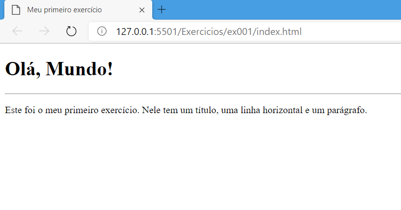

# Tags usadas no primeiro exercício

- `<h1></h1>` - Esta tag é usada para criar títulos.
- `

` - Esta tag é usada para criar parágrafos.
- `
` - Esta tag é usada para criar uma linha horizontal.

---

## Exemplo

- `<h1>Aqui vai o título</h1>`
- `
`
- `
Aqui vai o texto
`

---

## Imagem do resultado do exercício

