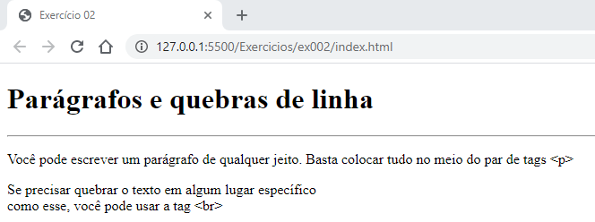

# Tags usadas no segundo exercício

- `<h1></h1>` - Esta tag é usada para criar títulos.
- `<p></p>` - Esta tag é usada para criar parágrafos.
- `<hr>` - Esta tag é usada para criar uma linha horizontal.
- `<br>` - Esta tag é usada para criar uma quebra de linha.

---

## Exemplo

```HTML
    <h1> Aqui vai o título</h1>
    <hr>
    <p>Aqui vai o texto com uma quebra <br> de linha.</p>
```

---

## Imagem do resultado do exercício


