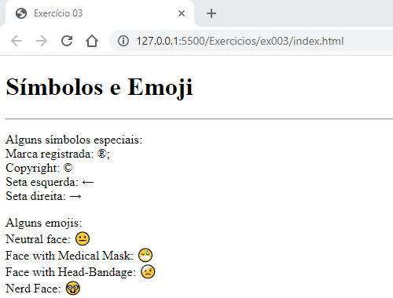

# Tags, símbolos e emojis usadas no terceiro exercício

- `<h1></h1>` - Esta tag é usada para criar títulos.
- `

` - Esta tag é usada para criar parágrafos.
- `
` - Esta tag é usada para criar uma linha horizontal.
- ` ` - Esta tag é usada para criar uma quebra de linha.
- `&#x` - Usado antes do código decimal de emojis. [Clique aqui para ver mais emojis](https://emojipedia.org/)
- **OBS:** Neste exercício, foi usando alguns símbolos. Esses símbolos são chamados de HTML Entities.

---

## Alguns HTML Entities

|Símbolo | Descrição        | Entitiy |
| ------ | ---------------- | ------- |
|&nbsp;  | Espaço em Branco | `&nbsp` |
|&reg;   | Marca registrada | `&reg`  |
|&copy;  | Copyright        | `&copy` |
|&larr;  | Seta esquerda    | `&larr` |
|&uarr;  | Seta cima        | `&uarr` |
|&rarr;  | Seta direita     | `&rarr` |
|&darr;  | Seta baixo       | `&darr` |

 

- [Clique aqui para ver mais HMTL Entities](https://www.w3schools.com/charsets/ref_utf_symbols.asp)

---

## Imagem do resultado do exercício

