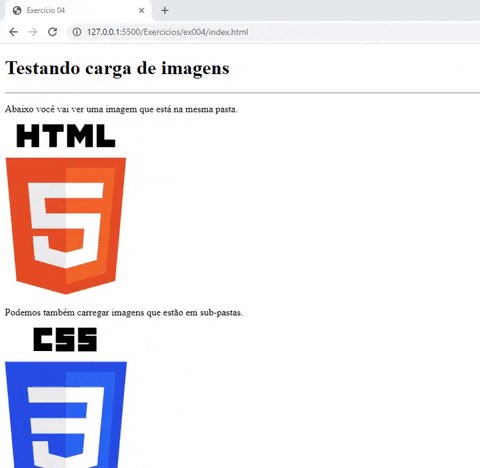

# Tags usadas no 004

- `<h1></h1>` - Esta tag é usada para criar títulos.
- `

` - Esta tag é usada para criar parágrafos.
- `
` - Esta tag é usada para criar uma linha horizontal.
- ` ` - Esta tag é usada para criar uma quebra de linha.
- `` - Esta tag é usada para adicionar imagem.

---

## Imagem do resultado do exercício

